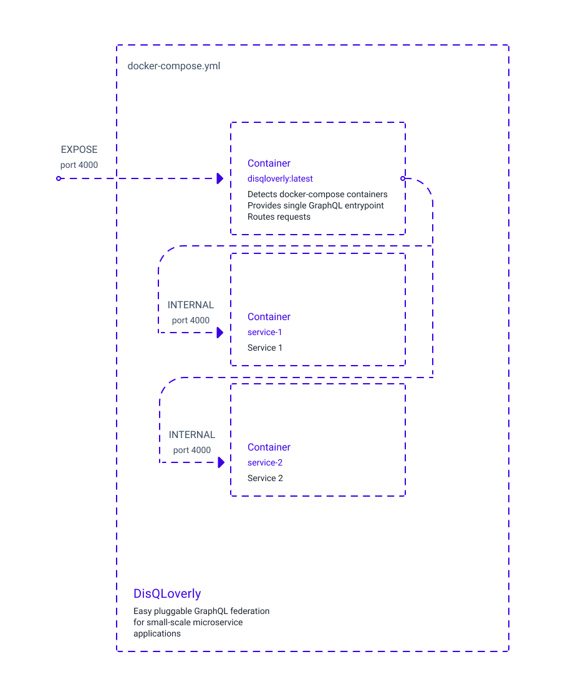

# DisQLoverly

## Description

DisQLoverly is a simple easy-to use zero-configuration GraphQL federation server for small-scale microservice applications.



## How it works

- DisQLoverly periodically fetches information about running containers from `/var/run/docker.sock` socket (readonly access is enough)

- DisQLoverly automatically reconfigures gateway endpoints URLs using internal docker network IP addresses and exposed IP ports

- Individual services must be [Subgraph-compatible](https://www.apollographql.com/docs/federation/other-servers)

## Try it by example

- Move into `example-services` directory and run `docker-compose`:

```
cd ./example-services
docker-compose up
```

- User service resolves `users` query (not publicly exposed)

```
query {
    users {
		username
	}
}
```

- Books service resolves `books` query (not publicly exposed)

```
query {
    books {
		title
		author
	}
}
```

- Federated service provides both `users` and `books` query (publicly exposed on port 4000)

```
query {
	books {
		title
		author
	}
	users {
		username
	}
}
```
